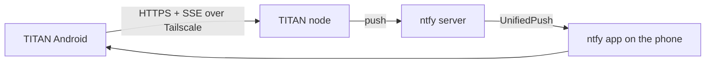

# TITAN for Android

**The Android client for [TITAN](https://github.com/vlukyanets/titan), a self-hosted AI assistant, planner and tracker for your household.**

Chat with your assistant, see today's plan, manage tasks, notes and trackers,
and answer reminders and approval requests from your phone. The app talks only
to your own TITAN nodes over [Tailscale](https://tailscale.com) and receives
push notifications through self-hosted [ntfy](https://ntfy.sh) with
UnifiedPush, so there is no Google or Firebase dependency.

> **Status:** the project is in its specification phase. There is no runnable
> code yet. Start with the [app spec](docs/spec/app.md) and the
> [roadmap](docs/roadmap/milestones.md).

## Features (v1 target)

- **Chat** with streamed answers and inline Approve and Reject buttons.
- **Today** view: events, time blocks, due tasks and habit check-ins together.
- **Tasks, calendar, notes and trackers** screens.
- **Notifications** with actions (Snooze, Done, Approve) that work without
  opening the app.
- **Calm offline behaviour**: when the connection drops, content stays on
  screen and a small offline badge appears. No blocking spinners.
- Material 3 with dynamic colour, Android 8.0 and newer.

## How it fits together

## Requirements

- A running TITAN backend ([titan](https://github.com/vlukyanets/titan)).
- Tailscale on the phone, signed in to the same tailnet.
- The ntfy app (or another UnifiedPush distributor) for notifications.

## Repositories

| Repository | Contents |
|---|---|
| [titan](https://github.com/vlukyanets/titan) | Backend, agent runtime, CLI, product spec |
| [titan-android](https://github.com/vlukyanets/titan-android) | Android app (this repo) |
| titan-web | Web UI (planned) |

## Documentation

- [Documentation index](docs/README.md)
- [App spec](docs/spec/app.md) and the
  [product spec](https://github.com/vlukyanets/titan/blob/master/docs/spec/product.md)
- [Architecture](docs/architecture/overview.md)
- [Decisions (ADRs)](docs/adr/)
- [Roadmap](docs/roadmap/README.md)

## Contributing

Read [CONTRIBUTING](docs/CONTRIBUTING.md) for the commit and pull request rules.
AI agents also follow [CLAUDE.md](CLAUDE.md).

## License

Released into the public domain under the [Unlicense](LICENSE).
