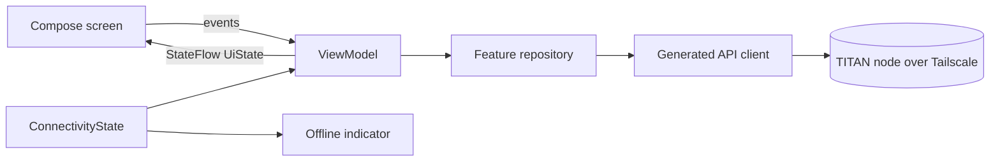

# Architecture overview

Status: **Draft**. This is the target architecture for the v1 app.

## Stack

| Concern | Choice |
|---|---|
| Language | Kotlin |
| UI | Jetpack Compose, Material 3, Navigation Compose |
| Dependency injection | Hilt |
| Networking | OkHttp, with a Retrofit + kotlinx.serialization client generated from OpenAPI |
| Streaming | Server-Sent Events over OkHttp (`okhttp-sse`) |
| Async | Kotlin coroutines and Flow |
| Secure storage | Android Keystore-backed storage for the device token |
| Push | UnifiedPush connector, ntfy as distributor |
| Build | Gradle Kotlin DSL, version catalog |
| minSdk / targetSdk | 26 / latest stable |

## Modules

```text
app/                 Application, navigation, DI setup
core/network/        generated API client, auth interceptor, SSE, fallback node addresses
core/connectivity/   ConnectivityState: online / offline / reconnecting
core/ui/             theme, shared components, offline indicator
feature/today/
feature/chat/
feature/tasks/
feature/calendar/
feature/notes/
feature/trackers/
feature/notifications/
feature/settings/
```

Feature modules depend on `core/*`, never on each other.

## Data flow



- ViewModels hold the last successful data in their `UiState`. A failed
  refresh **keeps the previous data** and only updates connection or error
  flags. This implements the "content stays visible" rule without any disk
  cache.
- `ConnectivityState` combines Android network callbacks with API reachability
  (a failed request or a lightweight health check against the current node). A
  scaffold-level composable shows the offline indicator from it.
- Loading indicators are local to the component being loaded (a pull-to-refresh
  or a small progress bar). A full-screen spinner is allowed only on the very
  first load of a screen that has no data yet.

## Chat streaming

The chat screen opens an SSE stream for the running agent turn. Event types
(tokens, tool activity, approval requests, completion) come from the backend's
OpenAPI components. If the stream breaks, the partial reply stays on screen,
the offline indicator appears, and the turn resumes or reloads when the
connection returns.

## Authentication

An OkHttp interceptor adds `Authorization: Bearer <device token>`. A `401`
response clears the token and returns to pairing.
